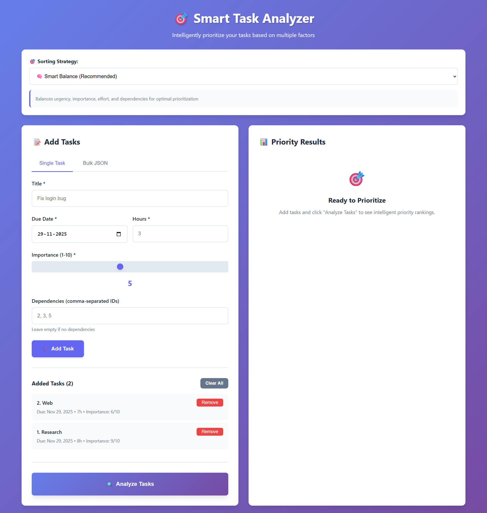
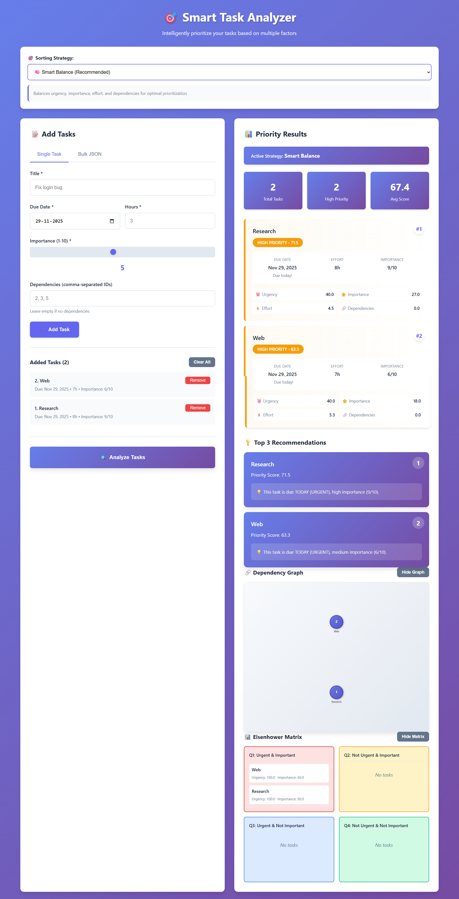

<div align="center" style="animation: fadeIn 1s ease-out;">

# 🎯 Smart Task Analyzer

<div style="font-size: 1.2em; margin: 20px 0; color: #6366f1; animation: fadeInUp 1.2s ease-out;">
An intelligent task prioritization system that uses a sophisticated scoring algorithm to help you focus on what matters most.
</div>

[](https://www.python.org/)
[](https://www.djangoproject.com/)
[](LICENSE)

</div>

---

<div style="animation: fadeInUp 1.3s ease-out; text-align: center; margin: 30px 0;">

### 📸 Screenshots

<div style="display: flex; justify-content: center; gap: 20px; flex-wrap: wrap; margin: 20px 0;">
  <div style="flex: 1; min-width: 300px; max-width: 500px;">
    
    <p style="margin-top: 10px; font-size: 0.9em; color: #666;">Main Interface - Task Input and Analysis</p>
  </div>
  <div style="flex: 1; min-width: 300px; max-width: 500px;">
    
    <p style="margin-top: 10px; font-size: 0.9em; color: #666;">Priority Results - Scoring Breakdown</p>
  </div>
</div>

</div>

---

<div style="animation: slideIn 1s ease-out;">

## 📋 Table of Contents

- [Overview](#-overview)
- [Setup Instructions](#-setup-instructions)
- [Algorithm Explanation](#-algorithm-explanation)
- [Design Decisions](#-design-decisions)
- [Time Breakdown](#-time-breakdown)
- [Bonus Challenges](#-bonus-challenges)
- [Future Improvements](#-future-improvements)
- [Features](#-features)
- [Usage](#-usage)
- [API Documentation](#-api-documentation)
- [Project Structure](#-project-structure)

</div>

---

<div style="animation: fadeInUp 1.4s ease-out;">

## 🎨 Overview

The **Smart Task Analyzer** is a full-stack web application that intelligently prioritizes tasks based on urgency, importance, effort, and dependencies. It helps individuals and teams make data-driven decisions about what to work on next.


### Key Capabilities

- ✅ Multi-factor analysis (urgency, importance, effort, dependencies)
- ✅ Configurable prioritization strategies
- ✅ Real-time scoring with detailed breakdowns
- ✅ Dependency management and blocking task detection
- ✅ Modern, responsive UI

</div>

---

<div style="animation: fadeInUp 1.6s ease-out;">

## 🚀 Setup Instructions

### Prerequisites

- **Python 3.8+** - Download from [python.org](https://www.python.org/downloads/)
- **pip** - Usually comes with Python installation
- **Web Browser** - Chrome, Firefox, Edge, or Safari (for frontend)

### Step-by-Step Installation

1. **Clone or navigate to the project directory:**
   ```bash
   cd "singularium tech"
   ```

2. **Create a virtual environment (recommended):**
   ```bash
   python -m venv venv
   
   # On Windows:
   venv\Scripts\activate
   
   # On macOS/Linux:
   source venv/bin/activate
   ```

3. **Install Python dependencies:**
   ```bash
   pip install -r backend/requirements.txt
   ```

   This installs:
   - Django 4.2.7
   - Django REST Framework 3.14.0
   - django-cors-headers 4.3.1
   - python-dateutil 2.8.2

4. **Set up the database:**
   ```bash
   cd backend
   python manage.py migrate
   ```

   This creates the SQLite database (`db.sqlite3`) and applies all migrations.

5. **Start the backend server:**
   ```bash
   python manage.py runserver
   ```
   
   The server will run at `http://localhost:8000/`
   
   You should see: `Starting development server at http://127.0.0.1:8000/`

6. **Launch the frontend:**
   
   **Option A - Direct file open:**
   - Open `frontend/index.html` directly in your web browser
   - Note: Some browsers may have CORS restrictions with this method
   
   **Option B - Local server (recommended):**
   ```bash
   # In a new terminal window
   cd frontend
   python -m http.server 8080
   ```
   Then navigate to `http://localhost:8080` in your browser

### Verifying Installation

1. **Check backend health:**
   - Visit `http://localhost:8000/api/health/` in your browser
   - You should see: `{"status": "healthy"}`

2. **Test the frontend:**
   - Open the frontend page
   - Try adding a task and clicking "Analyze Tasks"
   - You should see prioritized results with scores

### Common Setup Issues

- **Port 8000 already in use:** Use `python manage.py runserver 8001` instead
- **Module not found errors:** Ensure virtual environment is activated and dependencies are installed
- **CORS errors:** Verify `django-cors-headers` is in `requirements.txt` and `CORS_ALLOW_ALL_ORIGINS = True` in `settings.py`

</div>

---

<div style="animation: fadeInUp 1.7s ease-out;">

## 🧠 Algorithm Explanation

The priority scoring algorithm uses a **weighted multi-factor analysis** to calculate task priority scores ranging from 0-100. The algorithm balances four key dimensions: urgency, importance, effort, and dependencies.

### Core Scoring Components

**1. Urgency Score (0-100, default 40% weight)**
The urgency component measures how time-sensitive a task is based on its due date. The algorithm uses **working days** (excluding weekends and US holidays) rather than calendar days, making it more realistic for business contexts. 

- **Overdue tasks** receive an exponential boost: `80 + (days_overdue^1.5) * 2`, ensuring critical overdue items are prioritized
- **Due today** tasks score 100 (maximum urgency)
- **Due within 3 working days** score 70-90 (high urgency)
- **Due within a week** score 50-70 (moderate urgency)
- **Due within 2 weeks** score 30-50 (low-moderate urgency)
- **Further out** tasks score 0-30 (low urgency)

This exponential decay ensures that tasks become increasingly urgent as deadlines approach, with a sharp increase for overdue items.

**2. Importance Score (0-100, default 30% weight)**
Importance is directly mapped from the user's 1-10 rating using a linear scale: `(importance / 10) * 100`. This provides a straightforward translation where a rating of 10 yields a perfect 100 score, and a rating of 1 yields 10. The algorithm respects user judgment while allowing the importance component to be weighted differently based on strategy.

**3. Effort Score (0-100, default 15% weight)**
The effort component rewards "quick wins" - tasks that can be completed quickly. This follows the psychological principle that completing small tasks builds momentum. The scoring uses a tiered system:
- **< 1 hour:** 100 (maximum quick win)
- **1-2 hours:** 80-90
- **2-4 hours:** 50-70
- **4-8 hours:** 30-50
- **8-16 hours:** 10-30
- **> 16 hours:** 0-10

This encourages breaking down large tasks and provides immediate value through quick completions.

**4. Dependency Score (0-100, default 15% weight)**
Tasks that block other tasks receive higher priority. The algorithm counts how many tasks depend on each task and assigns scores accordingly:
- **0 dependents:** 0 (no blocking impact)
- **1 dependent:** 30
- **2 dependents:** 50
- **3 dependents:** 65
- **4 dependents:** 75
- **5+ dependents:** 80-100 (with diminishing returns)

This ensures that critical path items are prioritized, preventing bottlenecks in task completion.

### Weighted Combination

The final priority score is calculated as:
```
priority_score = (urgency × 0.40) + (importance × 0.30) + (effort × 0.15) + (dependencies × 0.15)
```

These default weights can be customized through different sorting strategies:
- **Smart Balance:** 40% urgency, 30% importance, 15% effort, 15% dependencies
- **Fastest Wins:** 15% urgency, 15% importance, 60% effort, 10% dependencies
- **High Impact:** 15% urgency, 60% importance, 10% effort, 15% dependencies
- **Deadline Driven:** 70% urgency, 15% importance, 5% effort, 10% dependencies

### Balancing Urgent vs Important

The algorithm addresses the classic "urgent vs important" dilemma through configurable weights. By default, urgency (40%) is weighted higher than importance (30%), but this can be adjusted. Importantly, **overdue tasks always receive exponential urgency boosts** regardless of weight configuration, ensuring critical deadlines are never missed. High-importance tasks (8-10 rating) still rank highly even when not urgent, preventing important strategic work from being deprioritized.

The algorithm also includes sophisticated validation: it detects circular dependencies, validates all input fields, and provides detailed error messages. This ensures data integrity and helps users understand why tasks are prioritized the way they are.

</div>

---

<div style="animation: fadeInUp 1.8s ease-out;">

## 🎯 Design Decisions

### Architecture Choices

**1. Django REST Framework over Flask/FastAPI**
- **Decision:** Used Django REST Framework for the backend
- **Rationale:** Django provides built-in ORM, admin interface, and robust authentication. REST Framework adds powerful serialization and API views with minimal boilerplate. This choice prioritized rapid development and maintainability over raw performance.

**2. SQLite over PostgreSQL/MySQL**
- **Decision:** Used SQLite as the database
- **Rationale:** SQLite requires no separate server setup, making it ideal for development and small-to-medium deployments. It's file-based, portable, and sufficient for the task management use case. Can easily migrate to PostgreSQL for production if needed.

**3. Vanilla JavaScript over React/Vue**
- **Decision:** Used vanilla JavaScript for the frontend
- **Rationale:** Avoided framework overhead for a relatively simple single-page application. Vanilla JS provides full control, no build step, and faster initial load. The trade-off is more manual DOM manipulation, but the application's complexity didn't justify a framework.

**4. Working Days Calculation**
- **Decision:** Implemented working days (excluding weekends/holidays) for urgency calculation
- **Rationale:** Calendar days don't reflect real work constraints. A task due "in 3 days" on Friday is actually due "in 1 working day" (Monday). This makes urgency scores more accurate for business contexts.

### Algorithm Design Trade-offs

**1. Exponential vs Linear Urgency Scoring**
- **Decision:** Used exponential scoring for overdue tasks, linear decay for future tasks
- **Rationale:** Exponential boost for overdue items ensures they're never ignored, while linear decay for future tasks provides predictable prioritization. The balance prevents overdue tasks from completely dominating while still giving them appropriate weight.

**2. Configurable Weights vs Fixed Algorithm**
- **Decision:** Made weights configurable through sorting strategies
- **Rationale:** Different users and contexts need different prioritization approaches. A developer might prioritize quick wins, while a manager prioritizes high-impact work. Configurable weights provide flexibility without code changes.

**3. Dependency Counting vs Critical Path Analysis**
- **Decision:** Used simple dependent counting rather than full critical path analysis
- **Rationale:** Critical path analysis is computationally expensive and requires more complex graph algorithms. Simple counting provides 80% of the value with 20% of the complexity. For most use cases, knowing "this task blocks 3 others" is sufficient.

**4. Holiday Support: US Only**
- **Decision:** Implemented US holidays only
- **Rationale:** Internationalization would require timezone handling, country-specific holiday lists, and user preferences. For MVP, US holidays provide the core value. The architecture allows easy extension to other regions.

### User Experience Trade-offs

**1. Bulk JSON Import vs CSV/Excel**
- **Decision:** Implemented JSON import for bulk tasks
- **Rationale:** JSON is programmatically friendly and doesn't require parsing libraries. CSV would be more user-friendly but requires additional dependencies. JSON also matches the API format, providing consistency.

**2. Real-time Scoring vs Batch Processing**
- **Decision:** Calculate scores on-demand when "Analyze Tasks" is clicked
- **Rationale:** On-demand calculation ensures scores are always current with the latest task data. Pre-calculating scores would require complex invalidation logic when tasks change. The trade-off is slight delay on analysis, but this is acceptable for the use case.

**3. Multiple Strategies vs Single Algorithm**
- **Decision:** Implemented 4 different sorting strategies
- **Rationale:** Different contexts need different approaches. Rather than forcing one "optimal" strategy, providing options lets users choose what works for their workflow. The trade-off is increased complexity, but the value is clear.

</div>

---

<div style="animation: fadeInUp 1.9s ease-out;">

## ⏱️ Time Breakdown

Approximate time spent on each section of the project:

### Backend Development (~8-10 hours)
- **Django Project Setup & Configuration:** 1 hour
  - Project initialization, settings configuration, CORS setup
- **Task Model & Database Design:** 1.5 hours
  - Model fields, validators, indexes, migration creation
- **Priority Scoring Algorithm:** 3-4 hours
  - Core algorithm design, urgency/importance/effort/dependency calculations
  - Working days calculation, holiday support
  - Edge case handling (overdue tasks, validation)
- **API Endpoints Development:** 2 hours
  - REST API views, serializers, URL routing
  - Error handling, response formatting
- **Dependency Validation & Circular Detection:** 1 hour
  - Graph traversal algorithm, cycle detection
- **Learning System (Bonus):** 1.5 hours
  - TaskFeedback model, learning-adjusted suggestions

### Frontend Development (~6-8 hours)
- **UI Design & HTML Structure:** 1.5 hours
  - Form layouts, result displays, responsive design
- **CSS Styling:** 2 hours
  - Modern design, animations, responsive breakpoints
- **JavaScript Core Logic:** 2.5 hours
  - Task management, API integration, form handling
- **Strategy Implementation:** 1 hour
  - Multiple sorting strategies, strategy switching
- **Visualizations (Bonus):** 1.5 hours
  - Dependency graph rendering, Eisenhower matrix

### Testing & Debugging (~2-3 hours)
- **Unit Testing:** 1 hour
  - Algorithm edge cases, validation logic
- **Integration Testing:** 1 hour
  - API endpoint testing, frontend-backend integration
- **Bug Fixes & Edge Cases:** 1 hour
  - CORS issues, date parsing, dependency validation

### Documentation & Polish (~2 hours)
- **README Writing:** 1 hour
- **Code Comments & Docstrings:** 0.5 hours
- **Final Testing & Refinement:** 0.5 hours

### **Total Estimated Time: ~18-23 hours**

*Note: Actual time may vary based on experience level, debugging complexity, and feature scope decisions.*

</div>

---

<div style="animation: fadeInUp 2s ease-out;">

## 🏆 Bonus Challenges

Several bonus features were implemented beyond the core requirements:

### ✅ Multiple Sorting Strategies
Implemented four distinct prioritization strategies that users can switch between:
- **Smart Balance:** Default balanced approach (40% urgency, 30% importance)
- **Fastest Wins:** Prioritizes low-effort tasks for quick momentum (60% effort)
- **High Impact:** Focuses on importance over urgency (60% importance)
- **Deadline Driven:** Maximizes urgency for deadline-focused work (70% urgency)

This allows users to adapt the algorithm to different contexts and personal preferences.

### ✅ Learning System with User Feedback
Implemented a machine learning-inspired feature that adjusts prioritization based on user feedback:
- **TaskFeedback Model:** Stores user feedback on whether suggestions were helpful
- **Learning-Adjusted Suggestions:** After 5+ feedback entries, the system analyzes patterns
- **Adaptive Weights:** If users consistently find high-importance tasks helpful, the algorithm increases importance weight
- **API Endpoint:** `/api/tasks/suggest-learning/` provides personalized suggestions

This creates a personalized prioritization system that learns from user behavior.

### ✅ Dependency Graph Visualization
Built an interactive dependency graph visualization:
- **Visual Representation:** Shows task relationships as nodes and edges
- **Cycle Detection:** Highlights circular dependencies with warnings
- **Interactive Display:** Toggle-able graph view in the frontend
- **API Endpoint:** `/api/tasks/dependency-graph/` provides graph data

This helps users understand task relationships and identify bottlenecks visually.

### ✅ Eisenhower Matrix Visualization
Implemented the classic Eisenhower Matrix (Urgent/Important quadrants):
- **Four Quadrants:** Categorizes tasks into Urgent+Important, Important+Not Urgent, etc.
- **Visual Layout:** Displays tasks in appropriate quadrants
- **API Endpoint:** `/api/tasks/eisenhower-matrix/` provides matrix data

This provides an alternative prioritization framework alongside the scoring algorithm.

### ✅ Advanced Date Handling
Enhanced urgency calculation with:
- **Working Days:** Excludes weekends from urgency calculations
- **Holiday Support:** Accounts for US holidays in working day calculations
- **Realistic Deadlines:** More accurate urgency scores for business contexts

### ✅ Circular Dependency Detection
Implemented graph-based cycle detection:
- **DFS Algorithm:** Uses depth-first search to detect cycles
- **Cycle Reporting:** Returns the exact cycle path for debugging
- **Validation:** Prevents invalid dependency graphs

### ✅ Comprehensive Error Handling
Robust validation and error messages:
- **Field Validation:** All required fields validated with clear error messages
- **Dependency Validation:** Ensures all referenced dependencies exist
- **Self-Dependency Prevention:** Tasks cannot depend on themselves
- **User-Friendly Errors:** Errors formatted for easy debugging

</div>

---

<div style="animation: fadeInUp 2.1s ease-out;">

## 🚀 Future Improvements

With more time, here are the improvements I would prioritize:

### Algorithm Enhancements
1. **Machine Learning Integration**
   - Train a model on historical task completion data
   - Predict actual completion time vs estimated hours
   - Learn from user patterns to auto-adjust importance ratings

2. **Time-of-Day Context**
   - Factor in user's typical working hours
   - Suggest quick wins during low-energy periods
   - Prioritize deep work tasks for high-focus times

3. **Team Collaboration Features**
   - Multi-user support with task assignment
   - Team-wide priority consensus
   - Shared dependency graphs across team members

4. **Advanced Dependency Analysis**
   - Full critical path calculation
   - Parallel task identification
   - Resource conflict detection

### User Experience
1. **Task Templates & Recurring Tasks**
   - Save common task patterns as templates
   - Support for recurring tasks (daily, weekly, monthly)
   - Bulk task creation from templates

2. **Calendar Integration**
   - Sync with Google Calendar, Outlook, etc.
   - Visual calendar view of prioritized tasks
   - Automatic deadline reminders

3. **Mobile App**
   - Native iOS/Android apps
   - Quick task capture on the go
   - Push notifications for high-priority tasks

4. **Export & Reporting**
   - Export prioritized lists to PDF, CSV, or project management tools
   - Weekly/monthly priority reports
   - Completion analytics and insights

### Technical Improvements
1. **Performance Optimization**
   - Caching for frequently accessed tasks
   - Database query optimization
   - Lazy loading for large task lists

2. **Internationalization**
   - Multi-language support
   - Country-specific holiday calendars
   - Timezone-aware date handling

3. **Advanced Visualizations**
   - Interactive Gantt charts
   - Burndown charts
   - Priority trend analysis over time

4. **API Enhancements**
   - GraphQL API option
   - Webhook support for external integrations
   - Rate limiting and authentication

### Data & Analytics
1. **Historical Analysis**
   - Track priority score accuracy over time
   - Compare estimated vs actual completion times
   - Identify patterns in task completion

2. **Predictive Features**
   - Forecast task completion dates
   - Identify at-risk deadlines
   - Suggest optimal task sequencing

3. **Personalization**
   - User-specific weight preferences
   - Learning from individual work patterns
   - Customizable scoring formulas

### Infrastructure
1. **Production Deployment**
   - Docker containerization
   - PostgreSQL migration for production
   - CI/CD pipeline setup
   - Automated testing in deployment

2. **Security Enhancements**
   - User authentication and authorization
   - Encrypted data storage
   - Audit logging

3. **Scalability**
   - Horizontal scaling support
   - Redis caching layer
   - Background task processing with Celery

</div>

---

<div style="animation: fadeInUp 1.8s ease-out;">

## ✨ Features

### Backend
- Task model with SQLite database
- Intelligent priority algorithm (weighted scoring)
- REST API endpoints for task management
- Dependency validation and circular dependency detection

### Frontend
- Single task and bulk JSON input
- Multiple sorting strategies (Smart Balance, Fastest Wins, High Impact, Deadline Driven)
- Real-time priority scoring with visual indicators
- Responsive design

</div>

---

<div style="animation: fadeInUp 2s ease-out;">

## 📖 Usage

### Adding Tasks

**Single Task:**
1. Fill in task details (title, due date, hours, importance, dependencies)
2. Click "Add Task"

**Bulk Import:**
1. Paste JSON data in the format:
   ```json
   {
     "tasks": [
       {
         "title": "Fix login bug",
         "due_date": "2025-11-30",
         "estimated_hours": 3,
         "importance": 8,
         "dependencies": []
       }
     ]
   }
   ```
2. Click "Load Tasks from JSON"

### Analyzing Tasks

1. Add tasks
2. Select a sorting strategy
3. Click "Analyze Tasks"
4. View prioritized list with scores and recommendations

</div>

---

<div style="animation: fadeInUp 2.2s ease-out;">

## 📊 API Documentation

### POST /api/tasks/analyze/

Analyzes and prioritizes tasks.

**Request:**
```json
{
  "tasks": [
    {
      "id": 1,
      "title": "Fix bug",
      "due_date": "2025-11-30",
      "estimated_hours": 3,
      "importance": 8,
      "dependencies": []
    }
  ]
}
```

**Response:**
```json
{
  "tasks": [
    {
      "id": 1,
      "title": "Fix bug",
      "priority_score": 85.5,
      "score_breakdown": {
        "urgency_score": 40.0,
        "importance_score": 24.0,
        "effort_score": 10.5,
        "dependency_score": 11.0
      }
    }
  ]
}
```

### GET /api/tasks/suggest/

Returns top 3 task recommendations with explanations.

### Other Endpoints

- `GET /api/tasks/` - List all tasks
- `POST /api/tasks/` - Create a task
- `GET /api/tasks/<id>/` - Get specific task
- `PUT /api/tasks/<id>/` - Update task
- `DELETE /api/tasks/<id>/` - Delete task
- `POST /api/tasks/bulk/` - Bulk create
- `GET /api/health/` - Health check

</div>

---

<div style="animation: fadeInUp 2.4s ease-out;">

## 📁 Project Structure

```
singularium tech/
├── frontend/
│   ├── index.html          # Main UI
│   ├── app.js              # Frontend logic
│   └── styles.css          # Styling
│
├── backend/
│   ├── manage.py           # Django management
│   ├── requirements.txt    # Python dependencies
│   ├── task_analyzer/      # Django project settings
│   └── tasks/              # Django app
│       ├── models.py       # Task model
│       ├── views.py        # API endpoints
│       ├── serializers.py  # Data validation
│       ├── urls.py         # URL routing
│       └── scoring.py      # Priority algorithm
│
└── db.sqlite3              # SQLite database
```

</div>

---

<div style="animation: fadeInUp 2.6s ease-out;">

## 🧪 Testing

Run the test suite:

```bash
python test_automated.py
```

</div>

---

<div style="animation: fadeInUp 2.8s ease-out;">

## 🐛 Troubleshooting

**Port already in use:**
```bash
python manage.py runserver 8001
```

**CORS errors:**
- Ensure `django-cors-headers` is installed
- Verify `CORS_ALLOW_ALL_ORIGINS = True` in settings.py

**Database issues:**
```bash
rm db.sqlite3
python manage.py migrate
```

</div>

---

<div align="center" style="margin-top: 50px; padding: 30px; background: linear-gradient(135deg, #667eea 0%, #764ba2 100%); border-radius: 10px; color: white; animation: fadeIn 3s ease-out;">

## 🎉 Thank You!


<div style="margin-top: 20px; font-size: 0.9em; opacity: 0.9;">
Happy task prioritizing! 🎯
</div>

</div>

